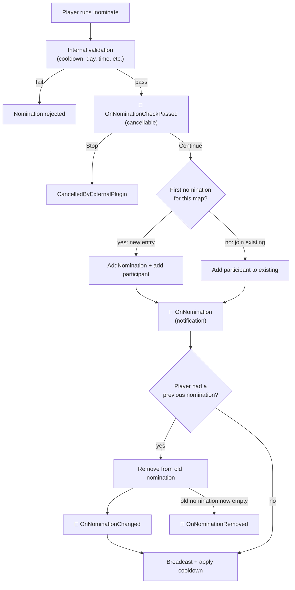
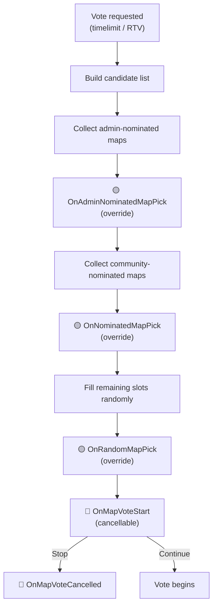
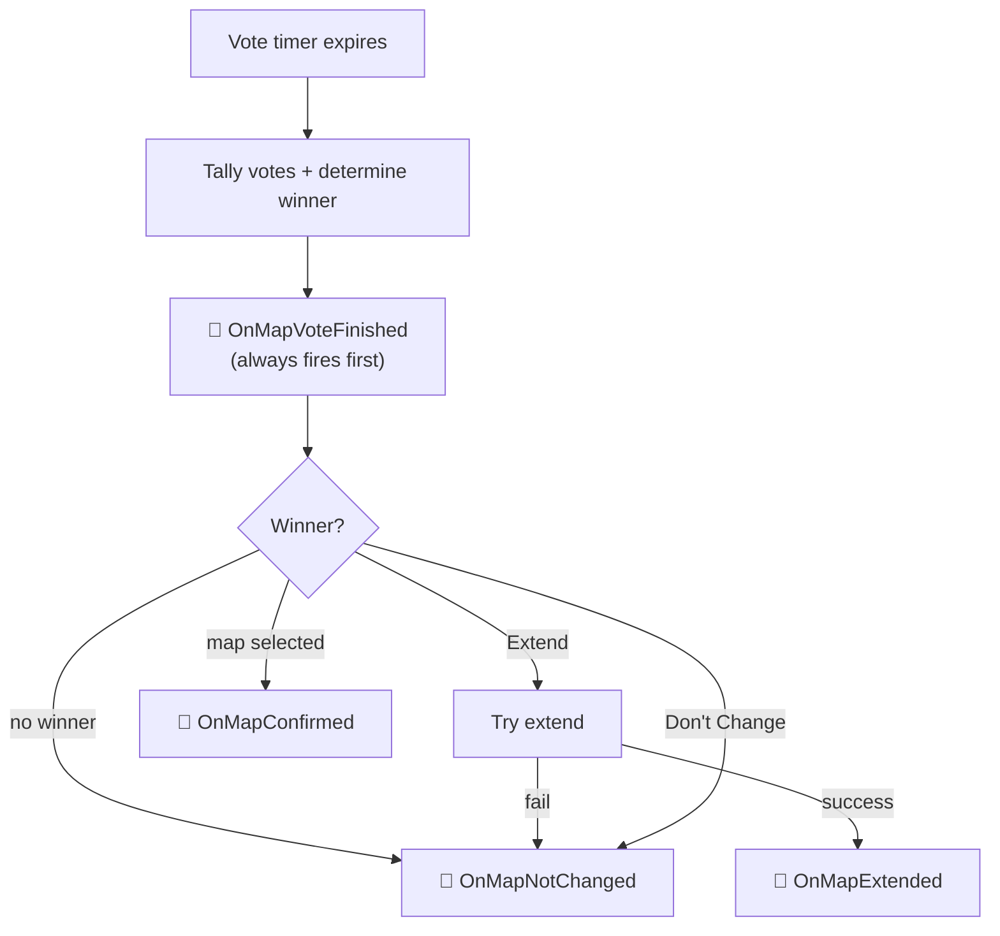

# Event System

MCS uses an event listener system to allow external plugins to observe and intercept actions across all subsystems.
Each subsystem has its own listener interface with default implementations on all methods, so you only need to override the events you care about.

---

## Core Concepts

### Listener Priority

All event listeners implement `IEventListenerBase`, which requires a `ListenerPriority` property:

```csharp
public int ListenerPriority { get; }
```

Higher values execute first. When two listeners have the same priority, execution order is not guaranteed.

### Cancellable Events

Methods returning `McsCancellableEvent` are cancellable. Return `Stop` to cancel the action:

```csharp
public McsCancellableEvent OnMapVoteStart(IMapVoteStartParams @params)
{
    // return Stop to cancel the vote, Continue to allow
    return McsCancellableEvent.Continue;
}
```

`McsCancellableEvent` is an enum with three values: `Continue` (allow the action to proceed), `Handled` (mark as handled and cancel — remaining listeners are skipped), `Stop` (cancel). Both `Handled` and `Stop` cancel the action; `Handled` is intended for cases where the listener has already taken an alternative action.

### Void Events

Methods returning `void` are notification-only. The action has already been committed or will proceed regardless.

### Editable Events

Some void events expose mutable parameters that listeners can modify before the action finalizes. These events implement `IMcsEditableEvent` (which provides `IsCancelled`). The primary example is `OnMapCooldownApply`.

### Override Events

Some events allow listeners to supply replacement data. Construct a `McsValueOverrideEvent<T>(value)` to override — the override applies when `value` is non-null (even an empty list counts as an override). Return `McsValueOverrideEvent<T>.NoOverride` for default behavior. Examples: `OnRandomMapPick`, `OnAdminNominatedMapPick`, `OnNominatedMapPick`.

---

## Event Flow Diagrams

### Nomination Flow



### Map Vote Candidate Selection Flow



### Map Vote Result Flow



Legend: 🔴 Cancellable &nbsp; 🟡 Override &nbsp; 🔵 Notification

---

## Registering Listeners

Each subsystem controller provides `InstallEventListener` and `RemoveEventListener`:

```csharp
// In OnAllModulesLoaded:
mcs.McsMapVoteController.InstallEventListener(new MyVoteListener());
mcs.McsNominationController.InstallEventListener(new MyNomListener());
mcs.MapCycleController.InstallEventListener(new MyCycleListener());
mcs.McsRtvController.InstallEventListener(new MyRtvListener());
```

---

## Event Listener Interfaces

### INominationEventListener

Install via `IMcsNominationController.InstallEventListener`.

| Method | Return | Type | Description |
|---|---|---|---|
| `OnNominationCheckPassed` | `McsCancellableEvent` | Cancellable | Fires after internal validation passes. Return `Stop` to add an external rejection (results in `CancelledByExternalPlugin`) |
| `OnNomination` | `void` | Notification | Fires after a normal nomination is committed. Use `OnNominationCheckPassed` to cancel |
| `OnAdminNomination` | `McsCancellableEvent` | Cancellable | Fires just before an admin nomination commits. Return `Stop` to cancel |
| `OnNominationChanged` | `void` | Notification | Fires when a player switches their nomination from one map to another (does NOT fire on initial nomination) |
| `OnNominationRemoved` | `void` | Notification | Fires when a nomination entry is removed entirely |
| `OnUnNominate` | `void` | Notification | Fires per client when a player's participation in a nomination is removed |
| `OnNominationMenuDetailsOpening` | `void` | Notification | Fires when a nomination detail menu is about to open. Add extra items via `ExtraItems` |

### IMapVoteEventListener

Install via `IMcsMapVoteController.InstallEventListener`.

| Method | Return | Type | Description |
|---|---|---|---|
| `OnMapVoteStart` | `McsCancellableEvent` | Cancellable | Fires before a vote starts. Return `Stop` to cancel |
| `OnAdminNominatedMapPick` | `McsValueOverrideEvent<List<IMapConfig>>` | Override | Fires when admin-nominated maps are picked for the vote. Return a value to override the admin-nominated candidate list |
| `OnNominatedMapPick` | `McsValueOverrideEvent<List<IMapConfig>>` | Override | Fires when community-nominated maps are picked for the vote. Return a value to override the nominated candidate list |
| `OnRandomMapPick` | `McsValueOverrideEvent<List<IMapConfig>>` | Override | Fires during random candidate selection. Return a value to override candidates, or `NoOverride` for default |
| `OnMapVoteFinished` | `void` | Notification | Fires when the vote completes (before individual result events) |
| `OnMapVoteCancelled` | `void` | Notification | Fires when the vote is cancelled |
| `OnMapExtended` | `void` | Notification | Fires when the vote result is map extension |
| `OnMapNotChanged` | `void` | Notification | Fires when no map change occurs: no winner, "Don't Change" selected, or Extend won but extend failed |
| `OnMapConfirmed` | `void` | Notification | Fires when the next map is confirmed by vote |

### IMapCycleEventListener

Install via `IMapCycleController.InstallEventListener`.

| Method | Return | Type | Description |
|---|---|---|---|
| `OnExtCommandExecute` | `McsCancellableEvent` | Cancellable | Fires when `!ext` is executed. Return `Stop` to cancel |
| `OnMapInfoCommandExecuted` | `void` | Notification | Fires after `!mapinfo` completes. Use to print additional information |
| `OnExtendVoteStarted` | `void` | Notification | Fires when an extend vote starts |
| `OnExtendVoteCancelled` | `void` | Notification | Fires when an extend vote is cancelled |
| `OnExtendVoteFinished` | `void` | Notification | Fires when an extend vote concludes (passed or failed) |
| `OnNextMapConfirmed` | `void` | Notification | Fires when the next map is confirmed |
| `OnNextMapRemoved` | `void` | Notification | Fires when the next map confirmation is removed |
| `OnMcsIntermission` | `void` | Notification | Fires when entering intermission |
| `OnMapCooldownApply` | `void` | Editable | Fires before **map-level** cooldown application. Group cooldowns and nomination cooldowns are not affected. `IsCancelled` suppresses the map cooldown but LastPlayedAt/UnplayedCount still update |
| `OnTimeLimitReached` | `void` | Notification | Fires when time or round limit is reached |
| `OnVoteStartThresholdReached` | `void` | Notification | Fires when remaining time/rounds cross the vote-start threshold |

### IRockTheVoteEventListener

Install via `IMcsRtvController.InstallEventListener`.

| Method | Return | Type | Description |
|---|---|---|---|
| `OnClientRtvCast` | `McsCancellableEvent` | Cancellable | Fires when a player attempts to join RTV. Return `Stop` to cancel |
| `OnClientRtvUnCast` | `McsCancellableEvent` | Cancellable | Fires when a player attempts to leave RTV. Return `Stop` to cancel |
| `OnForceRtv` | `McsCancellableEvent` | Cancellable | Fires when force RTV is about to trigger. Return `Stop` to cancel |
| `OnRtvConfirmed` | `void` | Notification | Fires when RTV is confirmed. Non-cancellable |

---

## Event Parameter Interfaces

### Base Interfaces

| Interface | Description |
|---|---|
| `IEventBaseParams` | Base for all event params. Provides `ModulePrefix(CultureInfo?)` for the module's localized prefix |
| `ICommandEventBaseParams` | Extends `IEventBaseParams`. Adds `Client` (nullable, null = console) and `Command` (ref `StringCommand`) |
| `IEnforceableEvent` | Marks events that can be admin-enforced. Provides `EnforcedByAdmin` and `Enforcer` (null + `EnforcedByAdmin = true` means console) |
| `IMcsEditableEvent` | Marks editable events. Provides `IsCancelled` (get/set) to suppress the action |

### Nomination Event Parameters

| Interface | Inherits | Properties |
|---|---|---|
| `IMcsNominationEventBaseParams` | -- | `Client` (`IGameClient?`), `NominationData` (`IMcsNominationData`) |
| `INominationCheckPassedEventParams` | `IEventBaseParams` | `Client` (`IGameClient?`), `MapConfig` (`IMapConfig`) |
| `INominationParams` | `IEventBaseParams`, `IMcsNominationEventBaseParams` | (see base) |
| `IAdminNominationParams` | `IEventBaseParams`, `IMcsNominationEventBaseParams` | (see base) |
| `INominationChangeParams` | `IEventBaseParams`, `IMcsNominationEventBaseParams`, `IEnforceableEvent` | (see bases) |
| `INominationRemovedParams` | `IEnforceableEvent`, `INominationParams` | (see bases) |
| `IUnNominateParams` | `IEventBaseParams`, `IMcsNominationEventBaseParams` | `Slot` (`int`), `Reason` (`UnNominateReason`) |
| `INominationMenuDetailsOpeningParams` | `IEventBaseParams` | `MapConfig` (`IMapConfig`), `Client` (`IGameClient`), `ExtraItems` (`List<McsMenuItem>`) |

### Map Vote Event Parameters

| Interface | Inherits | Properties |
|---|---|---|
| `IMapVoteStartParams` | `IEventBaseParams` | `MapsToVote` (`IReadOnlyList<IMapConfig>`), `VoteParticipants` (`IReadOnlyList<PlayerSlot>`) |
| `IAdminNominatedMapPickParams` | `IEventBaseParams` | `SelectedMaps` (`IReadOnlyList<IMapConfig>`) |
| `INominatedMapPickParams` | `IEventBaseParams` | `SelectedMaps` (`IReadOnlyList<IMapConfig>`) |
| `IMapVoteRandomMapPickParams` | `IEventBaseParams` | `MinimumMapCounts` (`int`), `MapConfigs` (`IReadOnlyDictionary<string, IMapConfig>`) |
| `IMapVoteFinishedEventParams` | `IEventBaseParams` | `VoteInformation` (`IMapVoteInformation`), `IsRtvVote` (`bool`), `NominatedMaps` (`IReadOnlyDictionary<string, IMcsNominationData>`) |
| `IMapVoteCancelledParams` | `IEventBaseParams` | `CancelledBy` (`IGameClient?` -- non-null only when cancelled via external `CancelVote(client)`; all internal cancellations pass `null`), `NominatedMaps` (`IReadOnlyDictionary<string, IMcsNominationData>`) |
| `IMapVoteExtendParams` | `IEventBaseParams` | `ExtendTime` (`int` -- minutes or rounds), `TimeLimitType` (`TimeLimitType`) |
| `IMapVoteNotChangedParams` | `IEventBaseParams` | (no additional properties) |
| `IMapVoteMapConfirmedEventParams` | `IEventBaseParams` | `ConfirmedMap` (`IMapConfig`), `MapInformation` (`IMapInformation`), `IsRtvVote` (`bool`) |

### Map Cycle Event Parameters

| Interface | Inherits | Properties |
|---|---|---|
| `IExtCommandExecuteEventParams` | `ICommandEventBaseParams` | `CurrentRequiredVotes` (`int`), `CurrentExtVotes` (`int`) |
| `IMapInfoCommandExecutedParams` | `ICommandEventBaseParams` | `MapConfig` (`IMapConfig`) |
| `INextMapConfirmedEventParams` | `IEventBaseParams` | `NextMap` (`IMapConfig`), `OldNextMap` (`IMapConfig?`) |
| `INextMapRemovedEventParams` | `IEventBaseParams` | `PreviousNextMap` (`IMapConfig`) |
| `IMcsIntermissionParams` | `IEventBaseParams` | `NextMap` (`IMapConfig`) |
| `IMapCooldownApplyEventParams` | `IEventBaseParams`, `IMcsEditableEvent` | `AppliesTo` (`IMapConfig`), `Cooldown` (`int`, get/set), `TimedCooldownDuration` (`TimeSpan`, get/set), `IsCancelled` (`bool`, get/set -- from `IMcsEditableEvent`) |
| `IExtendVoteStartedEventParams` | `IEventBaseParams` | `CurrentMap` (`IMapConfig?`), `Initiator` (`IGameClient?`), `VoteDuration` (`float` -- seconds) |
| `IExtendVoteCancelledEventParams` | `IEventBaseParams` | `CurrentMap` (`IMapConfig?`), `CancelledBy` (`IGameClient?`) |
| `IExtendVoteFinishedEventParams` | `IEventBaseParams` | `CurrentMap` (`IMapConfig?`), `Passed` (`bool`), `YesCount` (`int`), `NoCount` (`int`) |
| `ITimeLimitReachedEventParams` | `IEventBaseParams` | `LimitType` (`TimeLimitType`) |
| `IVoteStartThresholdReachedEventParams` | `IEventBaseParams` | `LimitType` (`TimeLimitType`) |

### RTV Event Parameters

| Interface | Inherits | Properties |
|---|---|---|
| `IClientRtvCastParams` | `IEventBaseParams` | `IsRtvTrigger` (`bool` -- `true` when this cast will reach or exceed the RTV threshold), `Client` (`IGameClient`) |
| `IClientRtvUnCastParams` | `IEventBaseParams`, `IEnforceableEvent` | `Client` (`IGameClient`) |
| `IForceRtvParam` | `IEventBaseParams`, `IEnforceableEvent` | `Client` (`IGameClient?`), `IsSilent` (`bool`) |
| `IRtvConfirmedParams` | `IEventBaseParams`, `IEnforceableEvent` | `Client` (`IGameClient?`), `IsForced` (`bool`) |

---

## Usage Examples

### Cancellable Event: Block a Vote

```csharp
public class MyVoteListener : IMapVoteEventListener
{
    public int ListenerPriority => 100; // high priority

    public McsCancellableEvent OnMapVoteStart(IMapVoteStartParams @params)
    {
        // Block votes with fewer than 3 candidates
        if (@params.MapsToVote.Count < 3)
            return McsCancellableEvent.Stop; // cancel

        return McsCancellableEvent.Continue; // allow
    }
}
```

### Editable Event: Modify Cooldown

```csharp
public class MyCycleListener : IMapCycleEventListener
{
    public int ListenerPriority => 0;

    public void OnMapCooldownApply(IMapCooldownApplyEventParams e)
    {
        // Double the cooldown for all maps
        e.Cooldown = e.Cooldown * 2;

        // Or cancel cooldown entirely:
        // e.IsCancelled = true;
    }
}
```

### Override Event: Custom Candidate Selection

```csharp
public class MyVoteListener : IMapVoteEventListener
{
    public int ListenerPriority => 0;

    public McsValueOverrideEvent<List<IMapConfig>> OnRandomMapPick(IMapVoteRandomMapPickParams @params)
    {
        // Filter candidates to only maps starting with "ze_"
        var filtered = @params.MapConfigs.Values
            .Where(m => m.MapName.StartsWith("ze_"))
            .ToList();

        if (filtered.Count >= @params.MinimumMapCounts)
            return new McsValueOverrideEvent<List<IMapConfig>>(filtered);

        return McsValueOverrideEvent<List<IMapConfig>>.NoOverride; // use default selection
    }
}
```

### Non-cancellable Event: Log RTV Confirmation

```csharp
public class MyRtvListener : IRockTheVoteEventListener
{
    public int ListenerPriority => 0;

    public void OnRtvConfirmed(IRtvConfirmedParams @params)
    {
        var who = @params.IsForced ? "admin" : "players";
        Logger.LogInformation("RTV confirmed by {Who}", who);
    }
}
```
